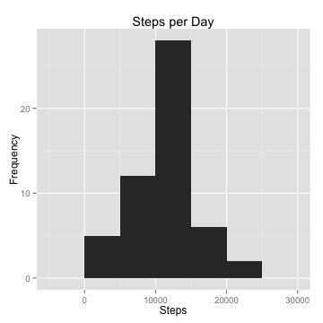
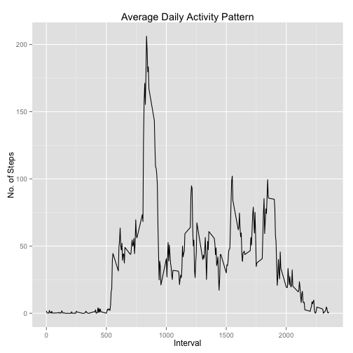
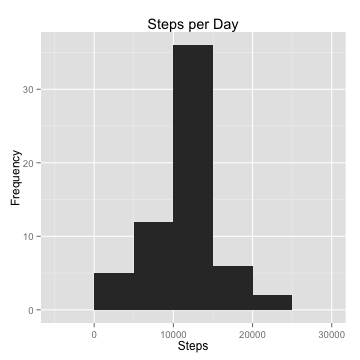
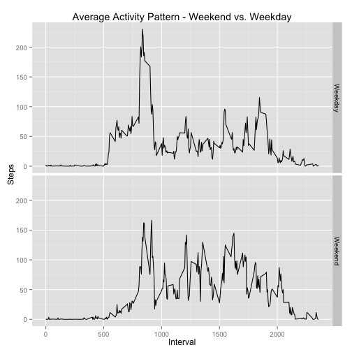

### Overview
This assignment makes use of data from a personal activity monitoring device. The data consists of two months of data from an anonymous individual collected during the months of October and November, 2012 and include the number of steps taken in 5 minute intervals each day.

The variables included in the dataset are:

* steps: Number of steps taking in a 5-minute interval (missing values are coded as NA)

* date: The date on which the measurement was taken in YYYY-MM-DD format

* interval: Identifier for the 5-minute interval in which measurement was taken

The dataset is stored in a comma-separated-value (CSV) file containing 17,568 observations.

### Loading and preprocessing the data


```r
## Load dependencies
library(dplyr)
library(ggplot2)

## The data is loaded and stored in a data frame called 'data'
data <- read.csv("activity.csv")

## Let's summarize the data
str(data)
```

```
## 'data.frame':	17568 obs. of  3 variables:
##  $ steps   : int  NA NA NA NA NA NA NA NA NA NA ...
##  $ date    : Factor w/ 61 levels "2012-10-01","2012-10-02",..: 1 1 1 1 1 1 1 1 1 1 ...
##  $ interval: int  0 5 10 15 20 25 30 35 40 45 ...
```

As we expect, the data frame contains 17,568 observations of 3 variables.  **steps** and **interval** are integer variables, whereas **date** is a factor variable with 61 levels, indicating 61 days.

### What is the mean total number of steps taken per day?
For this part of the assignment, we ignore the missing values in the dataset.

First, we calculate the total number of steps taken per day by using the **tapply** function to sum the **steps** variable for each level (i.e. each day) of the **date** variable.

```r
stepsbyday <- tapply(data$steps, data$date, sum)
```

We generate a histogram of the total number of steps taken each day.  We use a binwidth of 5000.

```r
qplot(stepsbyday, geom = "histogram", binwidth = 5000, 
      main = "Steps per Day", xlab = "Steps", ylab = "Frequency")
```

 

We calculate and report the mean and median of the total number of steps taken per day.

```r
mean(stepsbyday, na.rm = TRUE)
```

```
## [1] 10766.19
```

```r
median(stepsbyday, na.rm = TRUE)
```

```
## [1] 10765
```

### What is the average daily activity pattern?

We make a time series plot of the 5-minute interval (x-axis) and the average number of steps taken, averaged across all days (y-axis)

We create a new data frame called *stepsbyinterval*, which averages the number of steps for each of 288 unique intervals.

```r
stepsbyinterval <- aggregate(steps ~ interval, data = data, mean, na.rm = TRUE)
str(stepsbyinterval)
```

```
## 'data.frame':	288 obs. of  2 variables:
##  $ interval: int  0 5 10 15 20 25 30 35 40 45 ...
##  $ steps   : num  1.717 0.3396 0.1321 0.1509 0.0755 ...
```

We then generate a time series plot of average steps taken per 5-minute interval.

```r
p <- ggplot(stepsbyinterval, aes(interval, steps)) + geom_line() 
p <- p + ggtitle("Average Daily Activity Pattern") + labs(x = "Interval", y = "No. of Steps")
print(p)
```

 

Which 5-minute interval, on average across all the days in the dataset, contains the maximum number of steps?

```r
filter(stepsbyinterval, steps == max(stepsbyinterval$steps))
```

```
##   interval    steps
## 1      835 206.1698
```
On average across all 61 days, interval 835 contains the maximum number of steps, 206.

### Imputing missing values

There are a number of days/intervals with missing values (coded as NA). The presence of missing days may introduce bias into some calculations or summaries of the data.

We calculate and report the total number of missing values in the dataset (i.e. the total number of rows with NAs for the variable **steps**)

```r
sum(is.na(data$steps))
```

```
## [1] 2304
```

We fill in all of the missing values in the dataset using a simple strategy of substiuting a missing value for a given 5-minute interval with the mean value for that interval across all days.  We create a new data frame, *datafull*, equal to the original dataset but with the missing data filled in.


```r
## Create new data frame
datafull <- data

## Substitute each missing value with the mean for that interval, taken from the stepsbyinterval data frame
for (i in 1:nrow(datafull)) {
     if (is.na(datafull[i, ]$steps)) {
             datafull[i, ]$steps <- 
                     stepsbyinterval[stepsbyinterval$interval == datafull[i, ]$interval, ]$steps
     }
}

## Double-check that no missing values remain in the new data frame
sum(is.na(datafull$steps))
```

```
## [1] 0
```

We make a histogram of the total number of steps taken each day and calculate and report the mean and median total number of steps taken per day. We use a binwidth of 5000.


```r
stepsbydayfull <- tapply(datafull$steps, datafull$date, sum)

qplot(stepsbydayfull, geom = "histogram", binwidth = 5000, 
      main = "Steps per Day", xlab = "Steps", ylab = "Frequency")
```

 

Visually, the histogram is equivalent to the one generated above.


```r
mean(stepsbydayfull)
```

```
## [1] 10766.19
```
Unsurprisingly, the mean is the same as the original data frame, given that we substituted the missing values with the average number of steps for that interval.


```r
median(stepsbydayfull)
```

```
## [1] 10766.19
```
The median is now equal to the mean, and is 1.1886792 steps higher than the median of the original data frame, which is a difference of 0.01 percent, or negligible.

We can conclude that the mean and median total number of steps taken per day do not differ from the estimates from the first part of the assignment and that the impact of imputing missing data on the estimates of the total daily number of steps is negligible.

### Are there differences in activity patterns between weekdays and weekends?

We create a new factor variable in the dataset with two levels – “weekday” and “weekend” indicating whether a given date is a weekday or weekend day. We use the dataset with the filled-in missing values for this part.

```r
## Create new variable 'day', assigning the day of the week to each date
day <- weekdays(as.POSIXct(datafull$date))

## Substitute the days of the week with one of two values - "Weekend" or "Weekday"
for (i in 1:length(day)) {
        if(day[i] == "Sunday" || day[i] == "Saturday") {day[i] <- "Weekend"}
        else {day[i] <- "Weekday"}
}
## Convert 'day' to a factor variable
day <- as.factor(day)

## Add 'day' to the data frame
datafull <- mutate(datafull, day)
```

We make a panel plot containing a time series plot of the 5-minute interval (x-axis) and the average number of steps taken, averaged across all weekday days or weekend days (y-axis).


```r
stepsbyintervalandday <- aggregate(steps ~ interval + day, datafull, mean)
p <- ggplot(data = stepsbyintervalandday, aes(interval, steps)) 
p <- p + geom_line() + facet_grid(day ~ .) + labs(x = "Interval", y = "Steps") 
p <- p + ggtitle("Average Activity Pattern - Weekend vs. Weekday")
print(p)
```

 

During both weekdays and weekends, there is a spike in activity at the start of the day, but there is a notable difference in the remainder of the day - there is much more sustained activity on weekend days.

